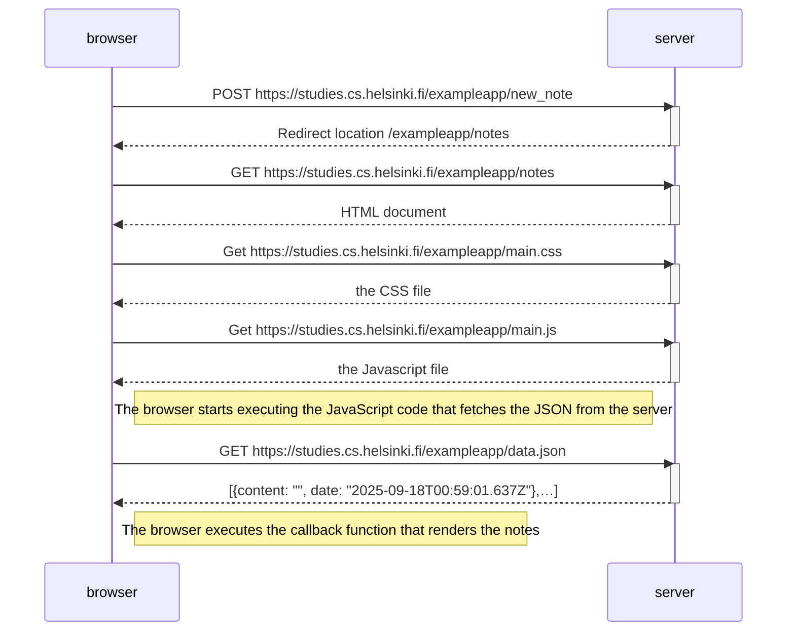
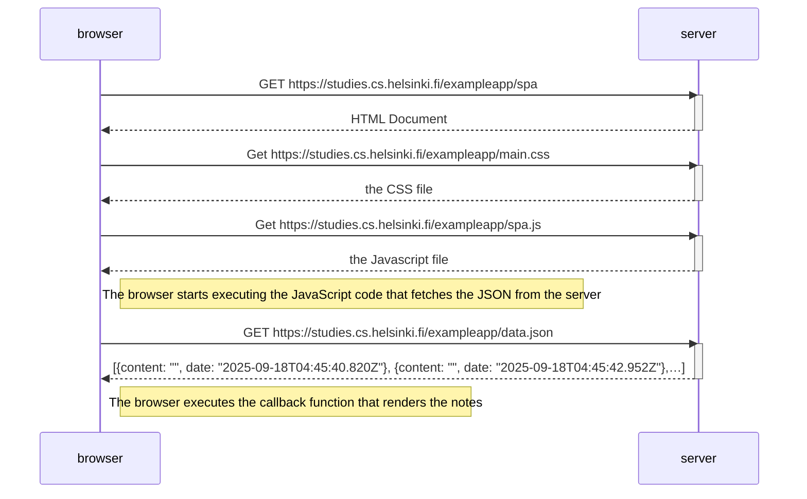
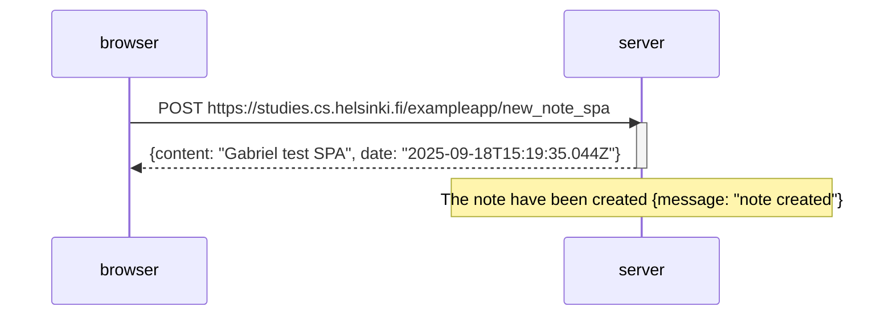

# Exercices Partie 1

## 0.4 : Nouvelle note

```mermaid
sequenceDiagram
  participant browser
  participant server

  browser->>server: POST https://studies.cs.helsinki.fi/exampleapp/new_note
  activate server
  server-->>browser: Redirect location /exampleapp/notes
  deactivate server

  browser->>server: GET https://studies.cs.helsinki.fi/exampleapp/notes
  activate server
  server-->>browser: HTML document
  deactivate server

  browser->>server: Get https://studies.cs.helsinki.fi/exampleapp/main.css
  activate server
  server-->>browser: the CSS file
  deactivate server

  browser->>server: Get https://studies.cs.helsinki.fi/exampleapp/main.js
  activate server
  server-->>browser: the Javascript file
  deactivate server

  Note right of browser: The browser starts executing the JavaScript code that fetches the JSON from the server

  browser->>server: GET https://studies.cs.helsinki.fi/exampleapp/data.json
  activate server
  server-->>browser: [{content: "", date: "2025-09-18T00:59:01.637Z"},…]
  deactivate server

  Note right of browser: The browser executes the callback function that renders the notes
```

## 0.5 : Application à page unique

```mermaid
sequenceDiagram
  participant browser
  participant server

  browser->>server: GET https://studies.cs.helsinki.fi/exampleapp/spa
  activate server
  server-->>browser: HTML Document
  deactivate server

  browser->>server: Get https://studies.cs.helsinki.fi/exampleapp/main.css
  activate server
  server-->>browser: the CSS file
  deactivate server

  browser->>server: Get https://studies.cs.helsinki.fi/exampleapp/spa.js
  activate server
  server-->>browser: the Javascript file
  deactivate server

  Note right of browser: The browser starts executing the JavaScript code that fetches the JSON from the server

  browser->>server: GET https://studies.cs.helsinki.fi/exampleapp/data.json
  activate server
  server-->>browser: [{content: "", date: "2025-09-18T04:45:40.820Z"}, {content: "", date: "2025-09-18T04:45:42.952Z"},…]
  deactivate server

  Note right of browser: The browser executes the callback function that renders the notes

```

## 0.6 : Nouvelle note

```mermaid
sequenceDiagram
  participant browser
  participant server

  browser->>server: POST https://studies.cs.helsinki.fi/exampleapp/new_note_spa
  activate server
  server-->>browser: {content: "Gabriel test SPA", date: "2025-09-18T15:19:35.044Z"}
  deactivate server

  Note over server: The note have been created {message: "note created"}
```
